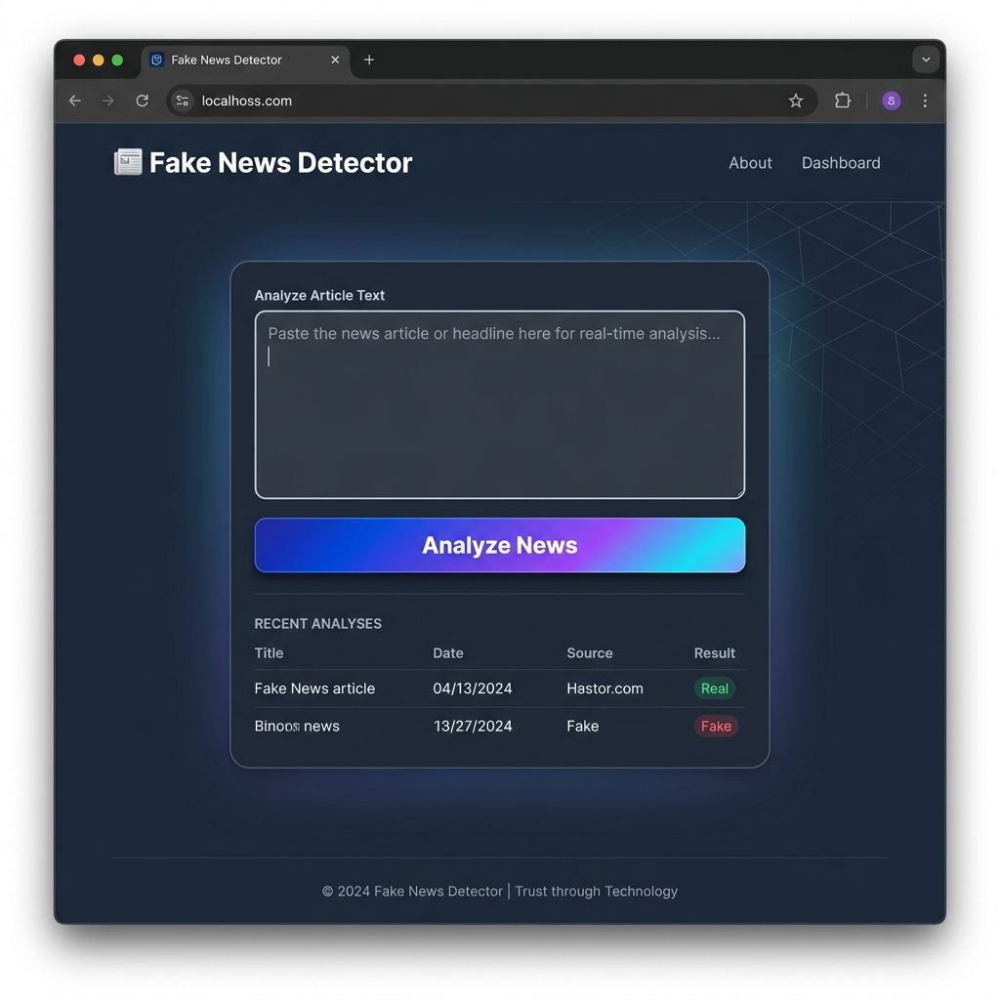

# 📰 Fake News Detector

A machine learning-powered web application that analyzes news articles to determine whether they are real or fake. Built with Python, Scikit-Learn, NLTK, and Streamlit.



## Overview

In the era of rapid information sharing, fake news can spread quickly and cause significant harm. This project uses Natural Language Processing (NLP) and a Logistic Regression classifier trained on a dataset of over 20,000 news articles to predict the authenticity of a given news text.

### Key Features
- **Real-Time Analysis**: Simply paste an article's text, and the model instantly predicts its authenticity.
- **NLP Preprocessing**: Robust text preprocessing including non-alphabetic character filtering, lowercasing, stemming (PorterStemmer), and stopword removal.
- **TF-IDF Vectorization**: Transforms textual data into meaningful numerical features for the ML model.
- **Beautiful UI**: A sleek, dark-themed responsive interface built with Streamlit and custom CSS.

## Getting Started

### Prerequisites
Make sure you have Python installed. You'll also need the following libraries:
- `streamlit`
- `pandas`
- `scikit-learn`
- `nltk`

### Installation

1. Clone this repository to your local machine.
2. Install the required dependencies:
   ```bash
   pip install streamlit pandas scikit-learn nltk
   ```
3. Run the application:
   ```bash
   streamlit run app.py
   ```
4. Open the provided localhost URL in your browser.

## How it Works

1. **Input**: The user pastes a news article into the Streamlit web interface.
2. **Preprocessing**: The text is cleaned. Special characters are removed, the text is converted to lowercase, and NLTK removes common English stopwords and applies Porter Stemming.
3. **Vectorization**: The cleaned text is transformed into a numerical format using the pre-fitted `TfidfVectorizer` (`tfidf_vectorizer.pkl`).
4. **Prediction**: The `LogisticRegression` model (`fake_news_model.pkl`) evaluates the vectorized text and returns a prediction (`0` for Real, `1` for Fake).

## Limitations & Future Work
*Note: The current model was trained heavily on political news from the 2016 US election era. Due to the nature of machine learning, it may struggle to accurately classify short, out-of-context sentences, or news topics that differ vastly from its training dataset (e.g., international economic reports). Future versions will focus on retraining the model with a more diverse, generalized dataset.*

## License
This project is open-source and available for educational purposes.
